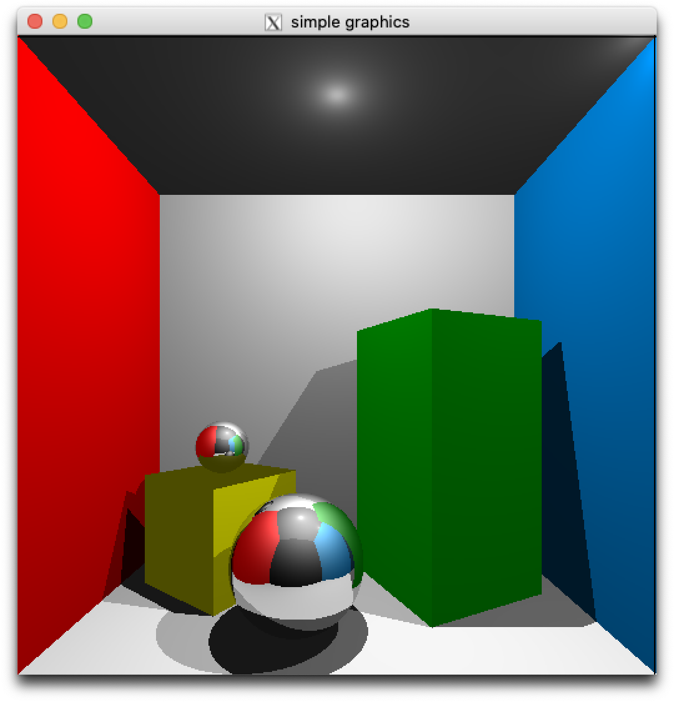

# Computer Graphics
CS580 Computer Graphics, 2020 Spring, KAIST

## About
Implementation of advanced graphics techniques mostly focusing on global illumination, as coursework of CS580 Computer Graphics.  
The skeleton was provided from the course, by KAIST [VISUAL COMPUTING Lab](vclab.kaist.ac.kr).

## Environments
Projects `raytracing` and `radiosity` are tested both in Mac OS clang++ (Refer to each project `CMakeLists.txt`) and Windows Visual Studio 2017.  
Project `path_tracing` is runnable only in Windows, and tested in Visual Studio 2017.

## Projects

### Raytracing
```
$ cd raytracing
$ mkdir build && cd build && cmake .. && make
$ ./raytracing < CS580_cornel_box.dat
```


### Radiosity
```
$ cd radiosity
$ mkdir build && cd build && cmake .. && make
$ ./radiosity
```
After running above commands, two windows appear. Click the smaller window, and then press 's' on the keyboard.


### Path Tracing
In `path_tracing/projectfiles`, open `CS580_pathtracer.sln`, and build `.exe` file using Visual Studio.  
Pass `.dat` file as command line argument, like below.
```
pathtracer.exe data/data.dat
```


